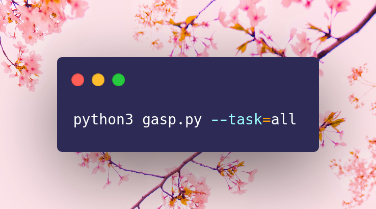
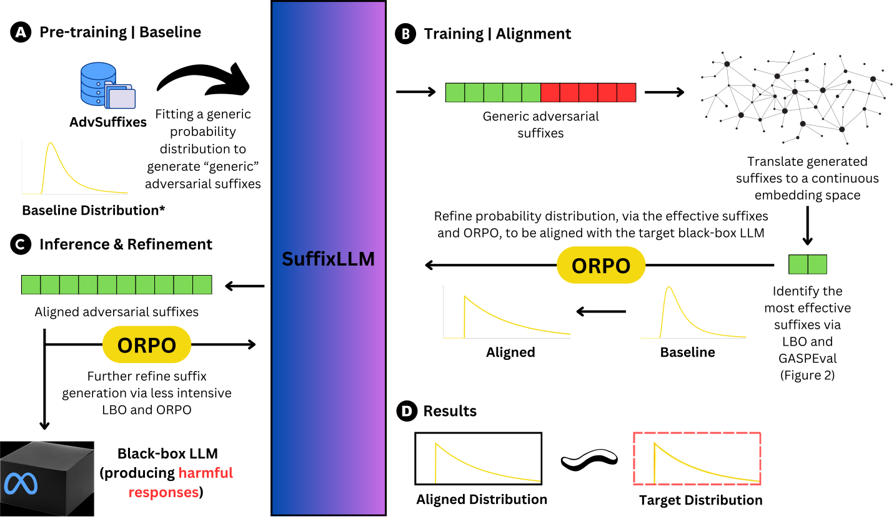

# GASP

This repo is an official implementation of GASP for the paper *GASP: Efficient Black-Box Generation of Adversarial Suffixes for Jailbreaking LLMs*. 

✨ Accepted as a Oral Presentation (& Poster) to ICLR 2025 - BuildingTrust Workshop 

Large Language Models (LLMs) have shown impressive proficiency across a range of natural language processing tasks yet remain vulnerable to adversarial prompts, known as jailbreak attacks, carefully designed to elicit harmful responses from LLMs. 
Traditional methods rely on manual heuristics, which suffer from limited generalizability. While being automatic, optimization-based attacks often produce unnatural jailbreak prompts that are easy to detect by safety filters or require high computational overhead due to discrete token optimization. Witnessing the limitations of existing jailbreak methods, we introduce Generative Adversarial Suffix Prompter (GASP), a novel framework that combines human-readable prompt generation with Latent Bayesian Optimization (LBO) to improve adversarial suffix creation in a fully black-box setting. GASP leverages LBO to craft adversarial suffixes by efficiently exploring continuous embedding spaces, gradually optimizing the model to improve attack efficacy while balancing prompt coherence through a targeted iterative refinement procedure. Our experiments show that GASP can generate natural jailbreak prompts, significantly improving attack success rates, reducing training times, and accelerating inference speed, thus making it an efficient and scalable solution for red-teaming LLMs.

❗ Refer to the [AdvSuffixes](./data/advsuffixes/README.md) directory for the AdvSuffixes dataset.



## 1. Installation
- Clone this anonymous repository to your local machine.
- Install all necessary dependencies on your machine. We would suggest using A100s for running GASP.

```bash
cd gasp
pip install -r requirements.txt
```

- To use a Docker image with all dependencies pre-installed, you can pull it directly from Docker Hub: `anonrsch001/gasp:latest`. This setup is recommended when working with schedulers like SLURM.

### 1.1 Configuration Setup
Refer to the [config documentation](./config/README.md) for details on key configurations that can be modified when running GASP. The `./config/` folder contains four main configuration files. We also suggest [downloading](https://huggingface.co/docs/hub/en/models-downloading) the necessary LLMs from HuggingFace (for SuffixLLM, at least). You may reference these downloaded models in the configuration files.

GASP currently supports model loading and inference from two primary providers: OpenAI and HuggingFace, with plans to expand to additional providers such as Anthropic, Deepseek, Groq and Cerebras.

## 2. Execution
Three task options are supported: `all`, `train`, and `eval`. To run both `train` and `eval` together:

```bash
python3 gasp.py --task=all
```

To run only `train` or `eval`, use:

```bash
python3 gasp.py --task=train
python3 gasp.py --task=eval
```

## 3. License
Our source code is under the GNU General Public License v3.0.

## 4. Authors
- [Advik Raj Basani](https://github.com/floofcat)
- [Xiao Zhang](https://github.com/xiaozhanguva)

If you are using GASP, please cite our paper:
```
@misc{gasp2024,
      title={GASP: Efficient Black-Box Generation of Adversarial Suffixes for Jailbreaking LLMs}, 
      author={Advik Raj Basani and Xiao Zhang},
      year={2024},
      eprint={2411.14133},
      archivePrefix={arXiv},
      primaryClass={cs.LG},
      url={https://arxiv.org/abs/2411.14133}, 
}
```

## 5. Ethical Statement
Our research and the development of GASP are driven by the commitment to advancing the understanding of LLM vulnerabilities. While GASP enables the efficient generation of coherent adversarial suffixes, it is worth noting that manual methods for jailbreaking LLMs have already been widely accessible. Our research seeks to formalize and characterize these vulnerabilities rather than introduce novel threats. 

In alignment with responsible disclosure practices, we have shared our findings with relevant organizations whose models were tested in this study and transparently disclosed all of our findings. 


